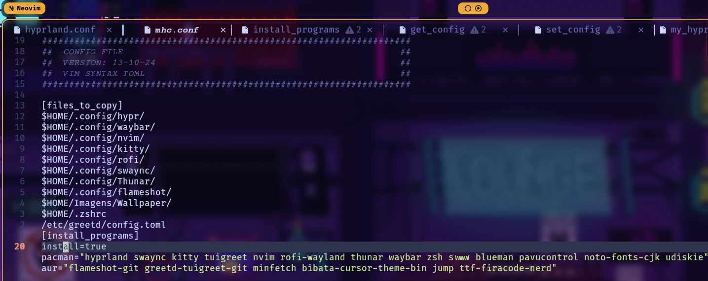

# my-hypr-config

My Hyprland config on Archlinux. Clone this repo and run 'my_hypr_config' like:

> [!IMPORTANT]
> You must be in Arch based distro and have a Aur package manager.

> [!CAUTION]
> Automated programs installation only supports yay and pikaur.

You can see here all the dependencies if you want to install them manually:
| Dependecies |
| ----------------------- |
| aur package manager |
| hyprland |
| kitty |
| swaync |
| rofi-wayland |
| tuigreet |
| nvim |
| thunar |
| waybar |
| zsh |
| swww |
| blueman |
| pavucontrol |
| noto-fonts-cjk |
| udiskie |
| flameshot-git |
| greetd-tuigreet-git |
| minfetch |
| bibata-cursor-theme-bin |
| jump |
| ttf-firacode-nerd |

## Config file (mhc.conf)

The configuration file is where are the configuration is... 😛



Section [files_to_copy]

> [!NOTE]
> One path per line.

Files path of each program configuration.

Section [install_programs]

The programs that must be installed to customization work awesome.

install - true by default, disable if yoyu don't want to installed programs.
pacman - list of packages to be installed with pacman package manager.
aur - list of packages to be installed with aur package manager.

> [!TIP]
> Use ´:set syntax=toml´ to make the file have colors.

## How to install

```
git clone git@github.com:dg2003gh/my-hypr-config.git
cd my-hypr-config
chmod +x my_hypr_config
./my_hypr_config
```


